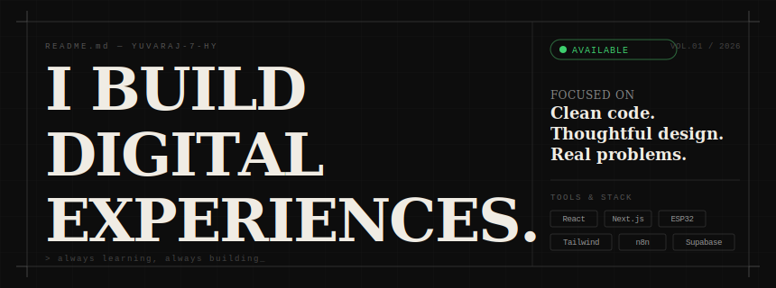

<!-- BANNER -->
<div align="center">



</div>

---

<!-- ABOUT -->
<table>
<tr>
<td width="60%" valign="top">

```
YUVARAJ
──────────────────────────────────────────
CSE student. Builder.
Designing systems, writing software,
and occasionally breaking things
in interesting ways.

Building in public.
One project at a time.
```

</td>
<td width="40%" valign="top">

```
LOCATION  ·  Mysuru, India
FOCUS     ·  Web Dev
CURRENTLY ·  Building cool things
OPEN TO   ·  Collaborations, internships
```

</td>
</tr>
</table>

---

<!-- PROJECTS HEADER -->

```
╔══════════════════════════════════════════════════════════════════════════════╗
║                              PINNED WORK                                    ║
╚══════════════════════════════════════════════════════════════════════════════╝
```

<!-- REPO CARDS - replace with your actual repos -->
<div align="center">

[](https://github.com/Yuvaraj-7-HY/Agora)&nbsp;&nbsp;
[](https://github.com/Yuvaraj-7-HY/portfolio-v2)

</div>

<!-- Add more repo cards by duplicating the pattern above. -->
<!-- Format: username=Yuvaraj-7-HY&repo=YOUR-REPO-NAME -->

---

<!-- STATS HEADER -->

```
╔══════════════════════════════════════════════════════════════════════════════╗
║                            CONTRIBUTIONS                                    ║
╚══════════════════════════════════════════════════════════════════════════════╝
```

<div align="center">

[](https://github.com/Yuvaraj-7-HY)

[](https://github.com/Yuvaraj-7-HY)

[](https://github.com/Yuvaraj-7-HY)

</div>

---

<!-- QUOTE -->

<div align="center">

```
┌────────────────────────────────────────────────────────┐
│                                                        │
│   "Simplicity is the ultimate sophistication."         │
│                                          — da Vinci    │
│                                                        │
└────────────────────────────────────────────────────────┘
```

</div>

---

<!-- FOOTER -->

<div align="center">

```
CREATE  ·  SOLVE  ·  REPEAT
```

`co/de` &nbsp;·&nbsp; Mysuru, India &nbsp;·&nbsp; 2026

</div>
